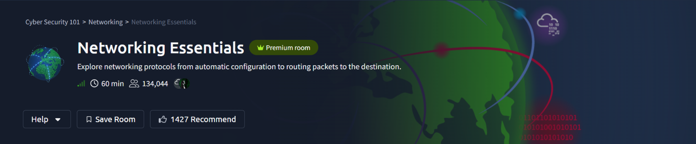
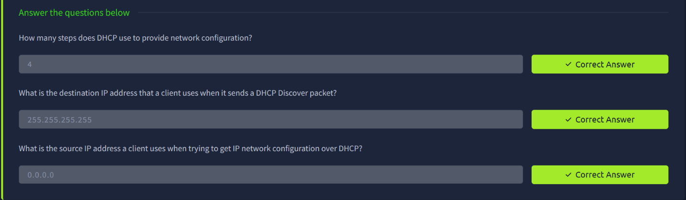
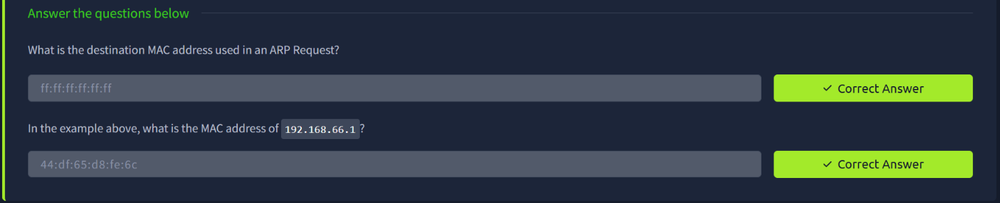
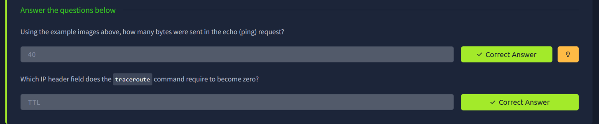
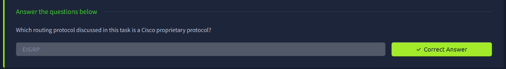
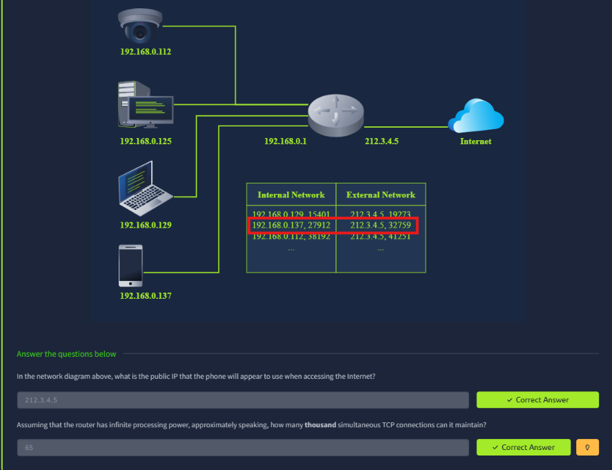
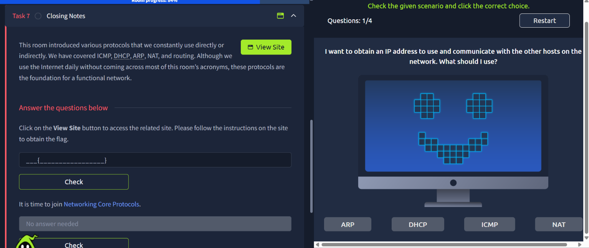
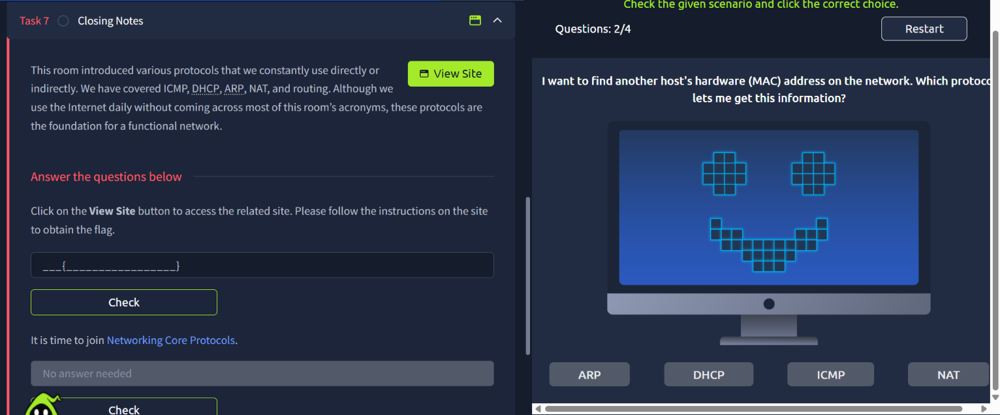
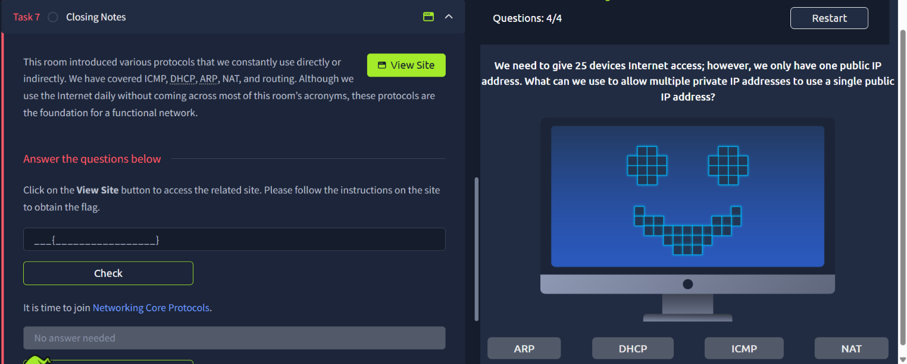
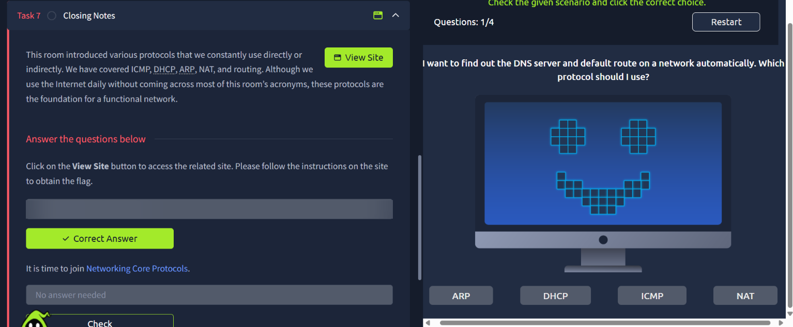

# TryHackMe — Networking Essentials

## Room Info

| | |
|---|---|
| **Room** | [Networking Essentials](https://tryhackme.com/room/networkingessentials) |
| **Path** | Cyber Security 101 → Networking → Networking Essentials |
| **Difficulty** | Info / Beginner |
| **Time** | ~60 min |
| **Category** | Networking Fundamentals |

## Room Description

This room explores the core protocols that make networks function day-to-day — from automatic IP configuration with **DHCP**, to hardware address resolution with **ARP**, connectivity diagnostics with **ICMP**, address sharing with **NAT**, and the basics of **routing**.

---

## Task 2 — DHCP (Dynamic Host Configuration Protocol)

DHCP automates IP configuration for devices joining a network, using a 4-step handshake commonly remembered as **DORA** (Discover, Offer, Request, Acknowledge). Since a client has no IP yet, it broadcasts its initial request.

**Q: How many steps does DHCP use to provide network configuration?**
`4`

**Q: What is the destination IP address that a client uses when it sends a DHCP Discover packet?**
`255.255.255.255`

**Q: What is the source IP address a client uses when trying to get IP network configuration over DHCP?**
`0.0.0.0`

---

## Task 3 — ARP (Address Resolution Protocol)

ARP maps a known IP address to its corresponding MAC address on the local network. An ARP **Request** is broadcast to every host, while only the owner of the target IP replies.

**Q: What is the destination MAC address used in an ARP Request?**
`ff:ff:ff:ff:ff:ff`

**Q: In the example above, what is the MAC address of `192.168.66.1`?**
`44:df:65:d8:fe:6c`

---

## Task 4 — ICMP (Internet Control Message Protocol)

ICMP handles diagnostics and error reporting — the protocol behind tools like `ping` and `traceroute`. `traceroute` works by sending packets with an incrementally increasing TTL and watching for the "TTL exceeded" ICMP response from each hop along the path.

**Q: Using the example images above, how many bytes were sent in the echo (ping) request?**
`40`

**Q: Which IP header field does the `traceroute` command require to become zero?**
`TTL`

---

## Task 5 — Routing

Routers forward packets between networks based on routing tables, which can be built manually (static routing) or automatically via routing protocols. Most routing protocols are open standards, but a few are vendor-specific.

**Q: Which routing protocol discussed in this task is a Cisco proprietary protocol?**
`EIGRP`

---

## Task 6 — NAT (Network Address Translation)

NAT lets many devices on a private network share a single public IP address for internet access. The router keeps an internal translation table mapping each internal (private IP, port) pair to a unique (public IP, port) pair, which is how it knows which internal device a returning packet belongs to.

**Approach:** Using the network diagram, traced how each internal device's private IP and port gets translated to the router's single public IP with a unique port number on the external side.

**Q: In the network diagram above, what is the public IP that the phone will appear to use when accessing the Internet?**
`212.3.4.5`

**Q: Assuming that the router has infinite processing power, approximately speaking, how many thousand simultaneous TCP connections can it maintain?**
`65` (thousand — bounded by the 16-bit port range, 0–65535)

---

## Task 7 — Closing Notes: Scenario-Based Recap

The final task ties everything together with a scenario-based quiz — given a networking need, pick the correct protocol out of ARP / DHCP / ICMP / NAT.

**Scenarios covered:**
1. Obtaining an IP address to communicate with other hosts on the network → **DHCP**
2. Finding another host's hardware (MAC) address on the network → **ARP**
3. Finding the DNS server and default route on a network automatically → **DHCP**
4. Giving 25 devices internet access using a single public IP address → **NAT**

Answering all four scenarios correctly unlocked the flag submission field for this task.

---

## Flag Capture

Following the **View Site** link and completing the linked interactive challenge returned the room's completion flag.

> 🚩 Flag value redacted — complete the linked scenario quiz on your own instance to retrieve it.

---

## Summary

| Task | Protocol / Skill | Key Concept |
|---|---|---|
| DHCP | Dynamic Host Configuration Protocol | 4-step (DORA) automatic IP assignment |
| ARP | Address Resolution Protocol | IP → MAC address resolution via broadcast |
| ICMP | Internet Control Message Protocol | `ping` / `traceroute` diagnostics, TTL expiry |
| Routing | Static & dynamic routing | Vendor-neutral vs. Cisco-proprietary (EIGRP) protocols |
| NAT | Network Address Translation | Many private IPs sharing one public IP via port mapping |
| Task 7 | Applied scenario reasoning | Matching real-world networking needs to the right protocol |

**Key takeaway:** This room built a working mental model of how a packet actually gets from a device to the internet and back — DHCP hands out the address, ARP resolves it locally, ICMP verifies reachability, routing gets it across networks, and NAT lets it share a public IP. These fundamentals underpin nearly every later networking and traffic-analysis room in the path.

---
*Part of my [Cyber Security 101](https://tryhackme.com/path/outline/cybersecurity101) TryHackMe learning path.*
